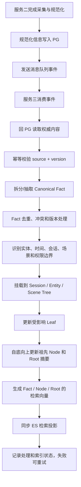
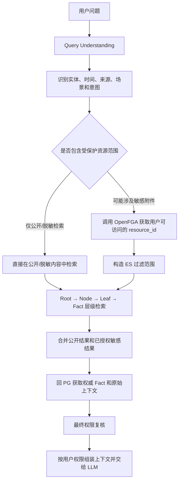

# RAG 流程设计

## 1. 文档目标

本文描述服务三（RAG/检索服务）从消息队列接收规范化信息，到构建记忆树、生成检索内容，再到面向不同人员返回结果的整体逻辑。

本文暂不规定 PostgreSQL 表结构、Elasticsearch 字段和索引 mapping，只确定数据流、职责边界、树形组织方式和权限行为。

## 2. 输入信息

服务三消费的消息表示一条已经由前置服务采集、清洗和规范化的信息。消息本身可以只携带标识，服务三再从 PostgreSQL 读取完整的权威内容。

一条信息至少应能关联以下内容：

- 组织、租户或知识库归属
- 采集人、发送人
- 来源会话、群聊、文档或附件
- 采集时间、发送时间，以及必要时的业务发生时间
- 规范化后的文本或结构化内容
- 原始消息/文档/附件的来源标识和版本
- 内容可见性和权限类型
- 文本是否已经脱敏
- 关联的项目、人物、系统等实体

权限信息用于描述资源的保护边界；最终用户是否有权访问受保护资源，仍由 OpenFGA 等授权系统判断。

## 3. 服务三的写入处理流程



### 3.1 消费与幂等

消息队列事件主要用于通知服务三“某个权威来源发生了新版本”。服务三不应把队列消息作为最终事实来源，而应根据来源标识和版本从 PG 读取规范化数据。

服务三需要用来源标识和版本做幂等判断，避免消息重复投递造成重复 Fact、重复挂载或重复索引。

服务二负责脱敏。服务三默认使用服务二已经标记为 `public` 或 `redacted` 的结果，不重复执行完整脱敏流程；服务三可以增加轻量规则校验，作为防止明显敏感内容漏出的第二道防线。

### 3.2 Canonical Fact

服务三将规范化信息拆成可检索的原子事实。一个 Fact 应能独立表达一个事件、状态、关系或结论，并保留回溯原始来源的关系。

例如：

```text
原信息：项目 A 已于 9 月 10 日上线，但部署失败，张三负责排查。

Fact 1：项目 A 于 9 月 10 日上线。
Fact 2：项目 A 上线后发生部署失败。
Fact 3：张三负责排查该部署失败。
```

Fact 可以被多个 Tree 引用，但正文只保留一份。事实更新时应关联新旧版本，而不是无条件删除历史事实；被覆盖、撤销或失效的事实在检索时不应作为当前有效答案。

### 3.3 挂载与摘要更新

Fact 识别完成后，服务三根据来源、实体、时间和语义场景建立 Tree 引用。Fact 先挂载到满足条件的 Leaf，再更新该 Leaf 以及向上的祖先摘要。

新增或变更 Fact 不需要重建整棵树，只更新受影响路径：

```text
Fact 变化
→ Leaf 摘要变化
→ 父 Node 标记待更新
→ 逐级更新 Node
→ 更新 Root 总体摘要
→ 重新生成受影响摘要的向量
```

PG 保存树结构、关系、版本和状态；ES 保存面向查询的摘要、Fact 文本和向量投影。查询时不需要逐层访问 PG，只有最终需要权威事实或原始上下文时才回 PG。

## 4. Tree 结构

一个知识库可以包含多棵 Tree。Tree 不是事实的复制品，而是同一批 Fact 的不同组织视图。

```text
Tree
└── Root
    └── Internal Node
        └── Leaf Node
            ├── Fact
            ├── Fact
            └── Fact
```

### 4.1 Root、Node 和 Leaf

- **Root**：一棵 Tree 的入口，概括整棵子树，负责第一阶段定位相关 Tree 或大范围主题。
- **Internal Node**：中间分组节点，按照时间、主题、实体状态或其他业务维度组织子树，并概括其所有后代内容。
- **Leaf Node**：最末级的事实容器。Leaf 不是一条 Fact，也不是必须对应一个文件，而是一组在主题、时间连续性和权限边界上相近的 Fact。
- **Fact**：可引用的原子事实，内容只保存一份，可以通过关系同时被多个 Tree 使用。

一个 Leaf 可以包含多个 Fact；一个文件或一段会话也可以因为时间、主题或权限边界不同而拆到多个 Leaf。不同权限级别的内容不应混入同一个 Leaf。

### 4.2 三种记忆视图

#### Session Tree

按会话、群聊或文档上下文的时间顺序组织信息，适合回答“当时讨论了什么”“某次会议后发生了什么”。

```text
Session Root：某群聊/会议的整体上下文
├── 时间片 Node：需求讨论
├── 时间片 Node：方案讨论
└── 时间片 Node：行动项和后续结果
```

#### Entity Tree

按项目、人物、系统等实体组织状态演化，适合回答“项目 A 当前状态”“谁负责某事项”“系统故障如何演变”。

```text
Entity Root：项目 A 的完整演化
├── 需求阶段
├── 开发阶段
├── 上线阶段
└── 故障处理阶段
```

#### Scene Tree

按语义场景或主题组织分散来源中的相关事实，适合回答“所有上线风险”“与合同变更相关的讨论”。

同一个 Fact 可以同时被挂载到 Session Tree、Entity Tree 和 Scene Tree，但不复制事实正文。

### 4.3 权限边界与树连续性

敏感附件仍然可以正常抽取 Fact、生成 Node/Root 摘要和向量。为了避免泄露，权限边界必须在树中保持清晰：

- 敏感附件的 Fact 应进入独立的受限 Leaf，必要时进入受限 Node。
- 公开或脱敏内容可以进入公开 Leaf/Node。
- 一个 Leaf 不混合公开内容和不同权限边界的敏感内容。
- 公开摘要不能包含敏感附件的具体内容、金额、条款等可推断信息。
- 受限子树仍可挂在同一个 Session/Entity/Scene 的父级下，因此不会割断来源、时间和会话上下文。

```text
Session Root：项目 A 会议
├── Node：会议讨论
│   ├── Leaf：公开/脱敏 Fact
│   └── Leaf：敏感附件 Fact（受限）
└── Node：后续行动
```

没有权限的用户可以看到公开上下文；有权限的用户在同一棵 Tree 下还可以继续检索受限 Leaf。树的连续性由父子关系和来源关系保持，而不是通过把所有内容混在同一个摘要中保持。

## 5. 向量化和检索投影

敏感内容不因为权限控制而停止向量化。否则用户获得权限后无法检索到该内容，且需要重新处理。

服务三应对以下内容生成检索表示：

- Fact 的规范化文本
- Node 覆盖子树的摘要
- Root 覆盖整棵 Tree 的摘要

Node/Root 的向量来自其子树摘要。PG 保存摘要和结构的权威版本，ES 保存可用于快速检索的投影。权限字段在 ES 中用于过滤和加速，但不替代 OpenFGA 的最终授权判断。

## 6. 查询和权限流程

### 6.1 查询总流程



### 6.2 OpenFGA 的使用范围

不要求所有文档、所有文本都进入 OpenFGA。推荐按内容状态区分：

- 公开文本：直接参与检索，不调用 OpenFGA。
- 已脱敏文本：只包含可公开语义，直接参与检索，不调用 OpenFGA。
- 未脱敏敏感附件：资源进入 OpenFGA，检索前获取用户当前可访问的附件/资源标识。
- 其他真正受限的原始内容：按资源纳入 OpenFGA。

ES 查询可以理解为：

```text
公开/脱敏内容
OR
resource_id 属于 OpenFGA 返回的可访问敏感资源
```

这样既不会让公开内容因为权限检查变慢，也不会让未授权附件进入向量排名。

调用 OpenFGA 前必须先确定用户当前的组织、租户和知识库范围。OpenFGA 返回的应是该范围内用户有权查看的敏感附件/资源集合，而不是全系统资源集合。随后将这些 `resource_id` 与公开/脱敏条件合并为 ES 过滤范围。

```text
公开/脱敏内容
OR
当前组织/知识库范围内、且 OpenFGA 授权给当前用户的敏感附件
```

如果用户可访问的敏感资源数量可控，可以先通过 OpenFGA 获取可访问资源集合，再作为 ES 的过滤条件。如果资源数量很大，可以先用组织、知识库等粗粒度范围缩小候选，再批量检查候选资源；不能只做“先全局向量召回、最后再过滤”，否则可能漏掉用户真正有权限的结果。

### 6.3 不同人员的结果展示

#### 普通无敏感权限用户

- 可以检索公开和已脱敏文本。
- 可以看到允许公开的文档元数据和上下文。
- 不返回敏感附件正文、敏感 Fact 或包含敏感细节的受限摘要。
- 如产品需要提示其存在，只能展示经过确认可公开的元数据，例如文档类型或更新时间；敏感标题和摘要也不能默认展示。

对于普通成员，如果产品需要提示受限资料存在，只能提供安全的概括性摘要，例如“该项目存在一份受限合同附件，最近一次更新于 9 月 10 日”，不能包含金额、条款、人员名单或足以推断正文的细节。

#### 对敏感附件有权限的用户

- 在公开/脱敏结果之外，可以检索授权附件的正文 Fact 和受限子树。
- 可以获得与附件相关的原始上下文，但仍只限于 OpenFGA 当前允许的资源。
- 权限变更后无需重新向量化；下一次查询使用新的授权范围即可生效。

#### 权限被撤销的用户

- 新查询不能再召回该敏感附件。
- 已缓存的检索结果和已组装上下文应按权限版本或短时效失效，不能继续复用。
- ES 中的向量和 PG 中的事实可以保留，等待后续重新授权或资源生命周期处理。

将用户加入或移出动态权限组，就是权限变更：Fact、Chunk、Tree 和向量通常都不变，变化的是 OpenFGA 对用户和资源的判断结果。服务三下一次查询会得到新的可访问 `resource_id` 集合，因此不需要重新向量化或重建 Tree。授权结果缓存、检索结果缓存和 LLM 上下文缓存必须按用户及权限版本失效或短时间过期。

## 7. 在线检索的层级逻辑

在线检索不是每次把三棵 Tree 全部搜索一遍，也不是把问题向量和所有 Fact 做全局比较。推荐路径是：

```text
问题理解和结构化过滤
→ Root 召回少量相关 Tree
→ 只在选中 Root 的子 Node 中继续匹配
→ 按 tree_id + parent 关系逐层下钻
→ 到 Leaf 后召回 Fact
→ 回溯来源和相邻上下文
→ 交给 LLM
```

Session、Entity、Scene 三种 Tree 共用统一的 Root 检索入口。Query Understanding 可以根据实体、时间和来源先缩小候选，再由 Root 的语义匹配决定主要进入哪类 Tree，避免固定地对三类 Tree 各执行一次完整检索。

## 8. 设计原则总结

1. PostgreSQL 是业务和记忆关系的权威来源；Elasticsearch 是查询加速层。
2. Fact 只保存一份，通过关系被多个 Tree 引用。
3. Leaf 是一组同主题、相近时间且权限边界一致的 Fact，不是一条 Fact。
4. 敏感附件正常向量化，但只有授权范围内才参与内容检索和返回。
5. 公开/脱敏文本不需要逐条调用 OpenFGA。
6. 权限边界不能只放在最终回答阶段，必须在 ES 召回前过滤受限内容。
7. Node/Root 摘要不能跨权限边界泄露敏感细节。
8. 新 Fact 只更新所在 Leaf 和祖先路径，不重建整棵 Tree。
9. OpenFGA 负责动态授权判断，ES 中的权限投影只用于缩小检索范围。

## 9. 已确认方向与待确认问题

已确认的方向：

1. 脱敏由服务二负责，服务三只做轻量校验。
2. OpenFGA 只管理未脱敏敏感附件等真正受限资源，不管理公开或已脱敏文本。
3. OpenFGA 查询必须限定当前组织、租户和知识库范围，只返回当前用户有权查看的敏感资源集合。
4. 普通成员可以看到受限资料的安全概括性摘要，但不能看到可推断正文的细节。
5. 用户加入或移出权限组只改变授权判断，不要求重新向量化或重建 Tree；相关缓存需要失效或短时过期。
6. Fact 冲突、撤销和版本演化需要在回答中支持展示，而不是只保留当前状态。

待确认问题：

1. 敏感文档的标题、文件类型、更新时间等元数据分别哪些允许无权限用户发现？
2. 权限分层后，公开父节点的安全摘要采用统一模板、规则生成，还是由模型生成后再做敏感信息校验？
3. 会话、实体和场景三类 Tree 的创建和合并规则由固定策略决定，还是允许后续人工/模型调整？
4. Entity 识别是否由服务三接管，以及实体标准名称、别名、合并和冲突处理规则是什么？
5. OpenFGA 返回集合的规模和缓存时效如何控制？
6. 权限撤销后，检索缓存和 LLM 上下文缓存的最长保留时间是多少？
