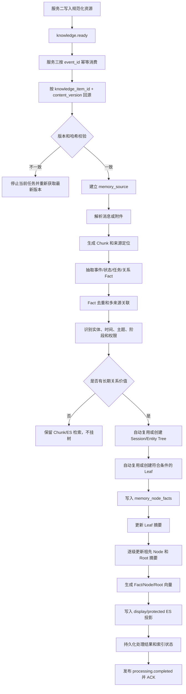
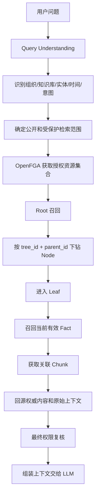

# 服务三最小流程闭环设计

> 状态：一期设计稿
>
> 目标：在不复制服务二权威正文的前提下，跑通“事件接收 → 回源 → Chunk → Fact → 树挂载 → 摘要与向量 → ES 检索 → 权限复核 → 上下文回源”的最小树形 RAG 闭环，并为后续 Scene Tree、多种检索方式和更多事实类型保留扩展空间。

## 1. 设计目标与边界

### 1.1 一期目标

一期实现以下能力：

1. 消费服务二发布的 `knowledge.ready` 事件。
2. 按 `knowledge_item_id + content_version` 从服务二 HTTP 回源权威内容。
3. 将消息或附件内容切分为 Chunk。
4. 从 Chunk 抽取事件、状态、任务、关系四类 Canonical Fact。
5. 支持 Fact 去重和多来源关联。
6. 自动挂载到 Session Tree 和 Entity Tree。
7. 更新 Leaf、祖先 Node 和 Root 摘要及向量。
8. 将公开/脱敏内容和受保护内容分别投影到 display/protected ES 索引。
9. 实现 Root → Node → Leaf → Fact 的逐层检索。
10. 在受保护内容召回前调用 OpenFGA，回源前再次复核权限。

### 1.2 服务边界

服务二继续负责：

- 规范化消息、KnowledgeItem 和附件元数据；
- 原始文件、展示内容和原始内容的对象引用；
- 组织、个人、知识库归属；
- 内容版本、ACL 版本、敏感级别和 OpenFGA 关系；
- `knowledge.ready` 等可靠事件。

服务三负责：

- 事件消费和处理幂等；
- HTTP 回源和版本校验；
- Chunk、Fact、实体识别和树挂载；
- Leaf/Node/Root 摘要和向量；
- ES 检索投影、多级召回和上下文组装；
- 处理状态、索引状态和结果事件。

服务三不直接读取或修改服务二数据库，不重复保存完整消息、附件或原始文件。

## 2. 总体数据层级

组织或个人只作为隔离空间，不直接作为业务树节点。树的最小层级如下：

```text
Organization Space / Personal Space
└── Knowledge Base
    ├── Session Tree
    │   └── Root
    │       └── Internal Node
    │           └── Leaf
    │               └── Fact
    │                   └── Chunk / Source
    └── Entity Tree
        └── Root
            └── Internal Node
                └── Leaf
                    └── Fact
                        └── Chunk / Source
```

### 2.1 隔离空间

隔离空间用于区分组织知识和个人知识：

- 组织空间必须绑定 `organization_id`；
- 个人空间必须绑定 `owner_user_id`；
- 一棵 Tree 只能属于一个空间和一个知识库；
- 私人信息默认只进入个人空间；
- 用户明确共享后，才建立组织侧逻辑来源、Fact 或挂载关系。

### 2.2 Knowledge Base

Knowledge Base 是同一组织或个人空间内的知识集合边界。Tree、Chunk、Fact 和索引投影都必须带有知识库范围，查询时必须先限定该范围。

### 2.3 Tree

一期支持两类 Tree：

| Tree 类型 | 主体 | 主要用途 |
|---|---|---|
| `session` | 会话、群聊或文档上下文 | 回答一次讨论、会议或上下文中发生了什么 |
| `entity` | 项目、人员、系统、合同等标准化实体 | 回答实体当前状态、历史变化和责任关系 |

一期预留 `scene` 类型，但不进入主写入链路。

Tree 的复用规则：

- 每个已接入会话在知识库内自动复用一棵 Session Tree；
- 每个标准化实体在知识库内自动复用一棵 Entity Tree；
- Tree 唯一键为 `knowledge_base_id + tree_type + subject_id`；
- 每棵 Tree 只有一个 Root。

### 2.4 Root、Internal Node 和 Leaf

- **Root**：一棵 Tree 的入口和总体摘要，`parent_id` 为空。
- **Internal Node**：按时间、主题、阶段或状态组织子树，只保存后代摘要。
- **Leaf**：最末级事实容器，保存一组时间、主题、阶段和权限边界相近的 Fact。

一期 Leaf 分组规则：

- Session Tree：时间桶 + 主题；
- Entity Tree：生命周期阶段/状态 + 主题；
- 不采用模型自由动态分组；
- 不同权限边界不能混入同一个 Leaf。

Fact 只通过关系挂到 Leaf；Root 和 Internal Node 不直接保存 Fact 正文。

## 3. Fact、Chunk 与附件关系

附件不是直接挂在 Leaf 下的事实。附件先被解析为 Chunk，再从 Chunk 中抽取 Fact：

```text
Message / Attachment
        ↓
Parsed Content
        ↓
Chunk
        ↓
Canonical Fact
        ↓
Leaf
```

服务三保存 Chunk 正文和来源定位，服务二/MinIO 继续保存原始文件和权威内容。

### 3.1 一期 Fact 类型

一期只抽取以下类型：

- `event`：发生了什么；
- `state`：当前或历史状态；
- `task`：待办、负责人和截止时间；
- `relation`：实体、人员、项目、系统之间的关系。

没有长期关系价值的内容，例如“收到”“好的”等，可以只保留 Chunk/ES 检索，不创建 Fact 或不挂载到 Tree。

### 3.2 Fact 多来源关联

同一个语义事实可以来自多条消息或多个附件：

```text
Fact F1
├── Chunk C1：会议消息
├── Chunk C2：项目周报
└── Chunk C3：合同附件解析片段
```

Fact 正文只保存一份，通过 `memory_fact_chunks` 保存多来源关系。

如果一个事实无法在不同权限来源之间安全拆分，Fact 按最严格来源权限处理。对可拆分的内容，优先拆成多个粒度更小的 Fact，避免公开事实被受限细节污染。

### 3.3 建议的核心表

```text
rag.memory_trees
rag.memory_nodes
rag.memory_sources
rag.memory_chunks
rag.memory_facts
rag.memory_fact_chunks
rag.memory_node_facts
rag.memory_entities
rag.processing_jobs
rag.index_records
rag.outbox_events
```

关键关系：

```text
memory_sources
    ↓
memory_chunks
    ↓ memory_fact_chunks
memory_facts
    ↓ memory_node_facts
memory_nodes
    ↓ parent_id
memory_trees
```

`memory_sources` 是服务三处理时的来源指针，不是服务二消息或附件的复制表。至少保存：

```text
source_type
source_id
knowledge_item_id
message_id / attachment_id
content_version
content_hash
acl_version
visibility
auth_object_key
```

## 4. 写入处理流程



### 4.1 幂等与版本

处理主键：

```text
knowledge_item_id + content_version + processing_version
```

附件至少使用：

```text
attachment_id + content_version + parsing_version
```

服务三必须保留并传递：

```text
content_version
content_hash
acl_version
processing_version
summary_version
embedding_model_version
mapping_version
```

旧版本任务不能覆盖新版本 Chunk、Fact、摘要或 ES 文档。

### 4.2 Leaf 挂载

Fact 选择 Leaf 时依次判断：

```text
Tree 相同
→ 时间范围相近
→ 主题相近
→ 阶段/状态相近
→ 权限边界一致
```

符合条件则复用 Leaf，否则创建新 Leaf。挂载成功后只更新该 Leaf 及其祖先路径，不重建整棵 Tree。

## 5. 附件和权限处理

敏感附件仍然正常解析、切 Chunk、抽取 Fact 和向量化，但进入受保护分支：

```text
公开/脱敏内容
→ display Chunk / Fact / Node

敏感附件内容
→ protected Chunk / Fact / Node
```

### 5.1 权限字段

Chunk、Fact、Node 和 ES 文档至少携带：

```text
organization_id
knowledge_base_id
knowledge_item_id
attachment_id
visibility
access_scope
sensitivity
auth_object_key
acl_version
```

Fact 默认继承来源 Chunk 权限。一个 Fact 有多个来源时，采用最严格来源原则：

```text
公开 + 公开 → 公开
公开 + 内部 → 内部
内部 + 受限 → 受限
```

### 5.2 双索引与 OpenFGA

一期采用：

```text
display/protected 双索引
+ OpenFGA 召回前过滤
+ 回源前最终复核
```

推荐索引：

```text
memory_display_facts_v1
memory_protected_facts_v1
memory_display_nodes_v1
memory_protected_nodes_v1
knowledge_display_chunks_v1
knowledge_protected_chunks_v1
```

查询受保护内容时：

1. 先限定当前用户的组织、租户和知识库范围；
2. 调用 OpenFGA 获取当前用户可访问的敏感资源 ID；
3. 使用授权 `resource_id/auth_object_key` 过滤 protected ES；
4. 召回后校验 ACL 版本；
5. 回源和交给 LLM 前再次做最终权限复核。

没有权限的用户不会获得相应的授权资源集合，因此敏感 Fact 不会进入召回结果。

### 5.3 父节点摘要安全

公开父节点不能把受限 Leaf 的具体内容汇总进去。建议维护：

```text
display_summary
protected_summary
```

公开摘要只使用公开/脱敏后代，或生成不包含敏感细节的安全概括；受限摘要可以使用授权范围内的完整内容。

## 6. 摘要与事实演化

摘要策略采用：

```text
结构化事实列表/统计
→ 模型生成自然语言摘要
→ 保存摘要版本、策略版本和输入内容版本
```

Fact 状态：

```text
active
superseded
revoked
historical
conflict
```

默认在线检索只召回 `active` Fact。只有用户询问历史、变化或演化过程时，才加入历史和冲突版本。

Fact 更新路径：

```text
Fact
→ 所在 Leaf
→ 祖先 Node
→ Root
→ 受影响摘要和向量
```

如果事实被覆盖、撤销或发生冲突，保留版本关系，不直接删除历史记录。

## 7. 在线检索流程



三类 Tree 不固定全量搜索。由结构化条件、实体、时间和 Root 语义匹配选出少量相关 Tree，再逐层下钻。

## 8. 可靠性、失败与重试

处理阶段建议使用：

```text
received
sourced
chunked
fact_extracted
tree_updated
summarized
vectorized
indexed
completed
failed
```

每个阶段记录：

```text
job_id
resource_id
resource_version
stage
retry_count
retryable
error_code
last_error
started_at
finished_at
```

失败策略：

- 阶段失败可重试；
- 超过重试次数进入死信；
- 支持按资源版本补偿重建；
- ES 失败不回滚 PG 权威派生关系；
- 完成状态和结果事件持久化后才 ACK 原事件；
- 旧事件不能覆盖新版本处理结果。

## 9. 最小验收场景

1. 一条消息生成多个 Fact，并同时挂载到 Session Tree 和 Entity Tree。
2. 多条消息或多个附件表达同一事实时，Fact 正文只保存一份，来源关系完整。
3. 一个附件产生多个 Fact，并按主题/阶段挂载到不同 Leaf。
4. 敏感附件只写入 protected Chunk/Fact/Node 索引。
5. 无权限用户无法召回敏感 Fact。
6. 有权限用户通过 OpenFGA 过滤后可以召回同一敏感 Fact。
7. 权限撤销后无需重新向量化，新查询不能继续返回受限内容。
8. 新 Fact 只更新受影响 Leaf 和祖先路径。
9. Fact 被覆盖、撤销或冲突时，默认查询不返回旧版本。
10. 重复投递同一 `knowledge.ready` 不产生重复 Chunk、Fact、挂载或索引。
11. 新版本任务不会被旧版本任务覆盖。
12. ES、摘要或模型调用失败后可以重试或从权威来源重建。
13. 私人空间数据不会被组织 Tree 检索到。

## 10. 后续扩展方向

一期闭环稳定后，再增加：

- Scene Tree 和固定场景字典；
- 更复杂的 Entity 合并、别名和冲突处理；
- 结构化键值查询、文档检索和 Tree 检索的 Query Planner；
- 更细粒度的 Leaf 动态切分；
- 公开/受限摘要的独立生成和安全审计；
- 图关系查询、缓存和更多检索投影；
- 事实置信度、人工确认和模型版本治理。

